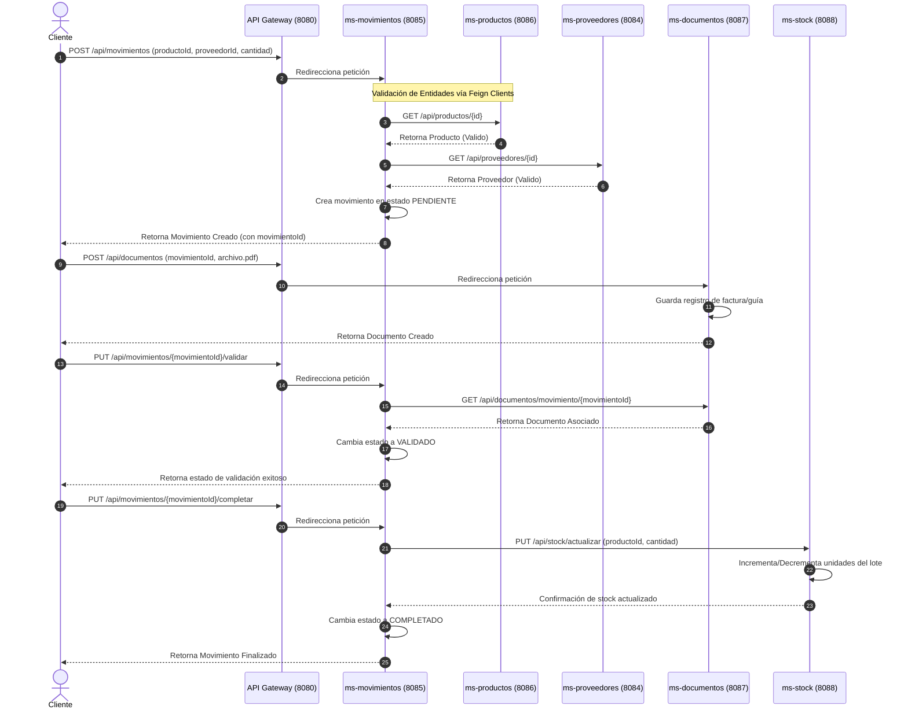

# Diagrama de Secuencia: Registro y Validación de Movimientos

Este diagrama representa el flujo crítico de registro de una entrada o salida de mercancía, la asociación de su documento de respaldo y la validación final que actualiza el stock disponible.

