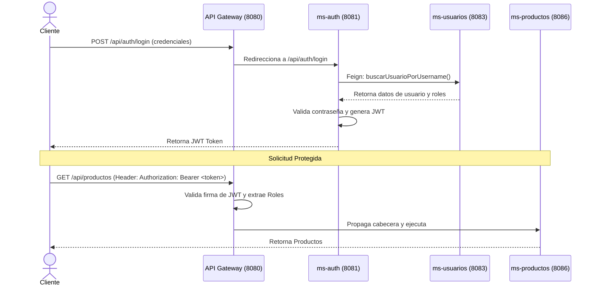

# Guía de Seguridad y Roles en PokeStock

Esta guía describe el flujo de seguridad, el uso de JSON Web Tokens (JWT) para la autenticación y la estructura de autorización basada en roles (RBAC) en el sistema.

---

## 1. Arquitectura de Seguridad

La seguridad en PokeStock está distribuida pero controlada perimetralmente:

1. **Autenticación (`ms-auth`)**: Expone los endpoints de `/register` y `/login`. Valida las credenciales, encripta contraseñas y genera el token firmado JWT.
2. **Autorización y Control Interno (`ms-security`)**: Gestiona la lista negra de tokens revocados (`blacklist`) para soportar procesos de Logout seguros, e implementa registros de auditoría interna de accesos y llamadas a la API.
3. **Control de Perfiles (`ms-usuarios`)**: Contiene la base de datos de usuarios y la relación con sus roles autorizados.

---

## 2. Flujo de Autenticación con JWT

---

## 3. Estructura de Roles del Sistema

El sistema implementa los siguientes roles preestablecidos para delimitar los accesos en el API Gateway:

| Rol | Código | Descripción / Permisos |
| :--- | :--- | :--- |
| **Administrador** | `ROLE_ADMIN` | Acceso total a todos los microservicios, administración de usuarios, roles y auditorías generales. |
| **Operador** | `ROLE_OPERATOR` | Permisos de lectura y escritura en los servicios de negocio de inventario (`ms-productos`, `ms-stock`, `ms-movimientos`). |
| **Auditor** | `ROLE_AUDITOR` | Permiso exclusivo de lectura de logs y reportes consolidados (`ms-reportes`, `ms-security`). |

---

## 4. Flujo de Cierre de Sesión (Logout y Blacklist)

Para invalidar un token JWT antes de su fecha natural de expiración:
1. El cliente envía una solicitud de cierre de sesión al Gateway.
2. El Gateway añade el token a la lista negra del servicio `ms-security` mediante el endpoint `/api/security/tokens/blacklist`.
3. En subsiguientes peticiones, el Gateway verifica si el token está bloqueado llamando a `/api/security/tokens/check-blacklist?token=<jwt>`. Si lo está, rechaza la solicitud de inmediato con código `401 Unauthorized`.
