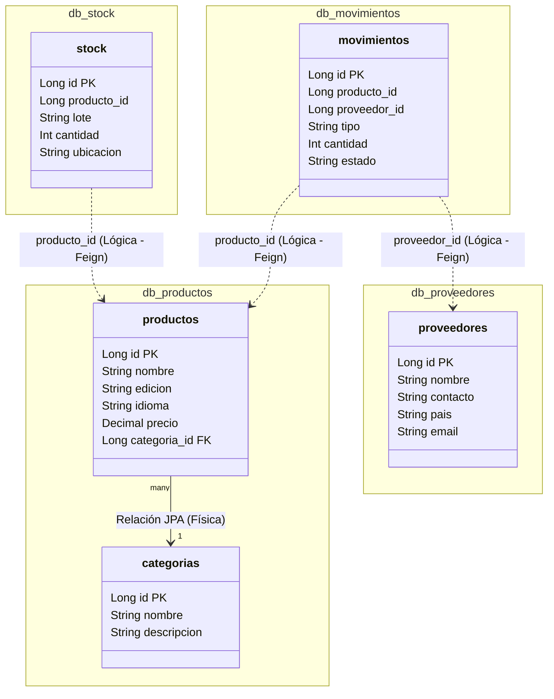

# MODELADO DE BASES DE DATOS Y RELACIONES EN MICROSERVICIOS

Este documento detalla el diseño de persistencia y la justificación de las relaciones entre microservicios para el proyecto **PokeStock**, respondiendo a las recomendaciones de diseño y de integridad referencial distribuida de la rúbrica del proyecto.

---

## 1. Estrategia de Persistencia: Una Base de Datos por Servicio

Para lograr un acoplamiento mínimo y máxima autonomía de desarrollo y escalabilidad, el sistema implementa el patrón **Database-per-Service**. Cada microservicio gestiona su propia base de datos dedicada, impidiendo consultas SQL cruzadas entre esquemas diferentes.

### Esquemas Independientes (MySQL):
* `db_auth` (ms-auth): Gestión interna de tokens.
* `db_security` (ms-security): Registro de auditorías y blacklist.
* `db_usuarios` (ms-usuarios): Credenciales, perfiles y roles de acceso.
* `db_productos` (ms-productos): Catálogo de productos y categorías de Pokémon TCG.
* `db_proveedores` (ms-proveedores): Directorio de proveedores oficiales.
* `db_stock` (ms-stock): Cantidades físicas y lotes en almacén.
* `db_documentos` (ms-documentos): Archivos de facturas o guías asociadas.
* `db_validaciones` (ms-validaciones): Auditorías de flujo comercial.
* `db_movimientos` (ms-movimientos): Orquestador e histórico de transacciones.
* `db_reportes` (ms-reportes): Registros históricos analíticos.

---

## 2. Diagrama de Relaciones Lógicas y Físicas (DER Distribuido)

El siguiente diagrama representa cómo conviven las relaciones **Físicas** (JPA internas en una base de datos) y las relaciones **Lógicas** (referencias cruzadas por ID entre distintos microservicios):

---

## 3. Justificación de Integridad Referencial Distribuida

En sistemas basados en microservicios, la ausencia de claves foráneas físicas (`FOREIGN KEY`) entre esquemas de bases de datos independientes es una consecuencia del diseño. Para mantener la consistencia de datos, implementamos **Integridad Referencial a Nivel de Aplicación**:

### 1. Validación en el Orquestador (`ms-movimientos`):
* Cuando un usuario intenta registrar un movimiento de inventario, el microservicio `ms-movimientos` **no** realiza un JOIN SQL directo.
* En su lugar, el servicio consume mediante **Feign Clients** (`ProductoClient` y `ProveedorClient`) los endpoints de validación remotos de los respectivos microservicios de negocio (`ms-productos` y `ms-proveedores`).
* Si el producto o proveedor no existen o no están marcados como "Activos", el orquestador aborta la transacción y lanza una excepción controlada, impidiendo la corrupción de datos.

### 2. Relaciones Físicas vs Lógicas:
* **Relación Física (JPA interna)**: Ocurre únicamente en dominios del mismo contexto delimitado, por ejemplo, **`Producto`** y **`Categoria`** comparten la misma base de datos (`db_productos`), permitiendo una relación clásica `@ManyToOne` con clave foránea física.
* **Relación Lógica (Feign)**: Ocurre entre contextos delimitados distintos (por ejemplo, `ms-stock` no conoce la estructura de `ms-productos`, solo almacena el `producto_id` como referencia numérica).

### 3. Tolerancia a Fallos Remotos:
* Las llamadas entre microservicios están protegidas mediante capturas de excepciones y validaciones de estados (por ejemplo, `FeignException` o `ServiceUnavailable`). Si un microservicio externo crítico está caído, la operación se revierte en la base de datos de origen, asegurando consistencia.
